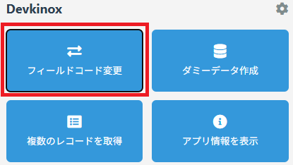
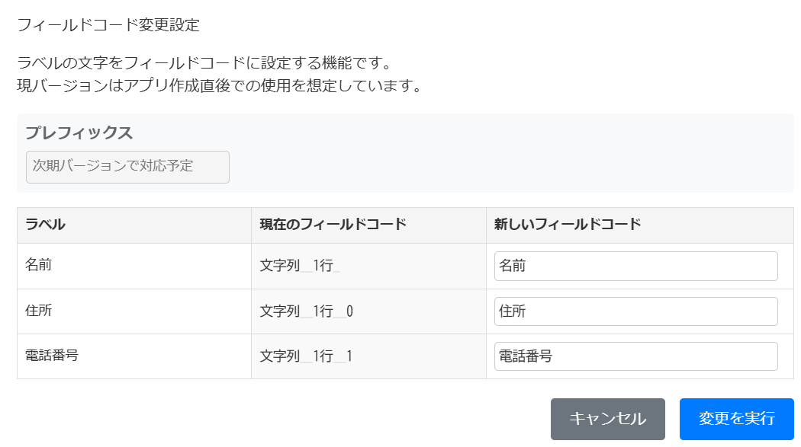
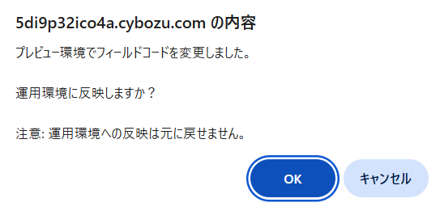

# フィールドコード変更

フィールドコードをラベルと同じ名称などに一括で変更できます。(CSV 取り込みなどでのアプリ作成時に使用ください)

## 使い方

1.  アプリの`一覧画面`、`詳細画面`のいずれかを開いた状態で`フィールドコード変更`を選択

    

 

2.  各フィールドのフィールドコードをこの画面で設定可能です。`新しいフィールドコード`欄に変更後のフィールドコードを設定して、`変更を実行`ボタンを押してください。

 

3. まずは、運用環境ではなくプレビュー環境でフィールドコードが変更されます。運用環境への反映する場合は`OK`ボタンを押してください。変更後の状態を確認してから運用環境に反映する場合は`キャンセル`ボタンを押してから、kintone のアプリ設定画面で反映をしてください。

   

## 注意事項

> [!CAUTION]
> この機能はアプリ作成直後の使用を想定しています。一括で全てのフィールドコードを変更する為、運用中アプリでの利用はお勧めしません。

> [!NOTE]
> ゲストスペースのアプリは現行バージョンでは非対応です。

<!-- > [!NOTE] -->
<!-- > [!TIP] -->
<!-- > [!IMPORTANT] -->
<!-- > [!WARNING] -->
<!-- > [!CAUTION] -->

## その他

### 作成者

- たむら
  - 𝕏: [@Tam4641](https://x.com/Tam4641)
