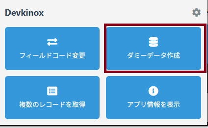
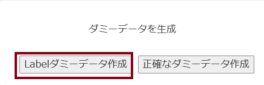
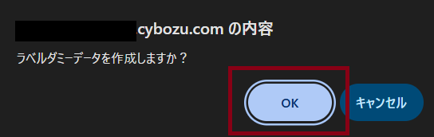
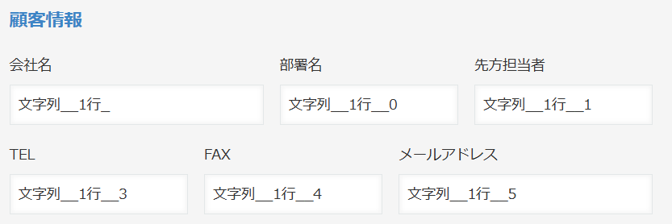

# ダミーデータ作成

アプリの詳細画面の「文字列（１行）」フィールドへ、ダミーデータが自動入力されます。

## 使い方

1.  アプリの`編集画面`のを開いた状態で`ダミーデータ作成`を選択

    

 

2.  `ダミーデータを生成`を選択

 

3. `OK`を選択

   

4.空白の文字列フィールドにフィールドコードの値が自動入力される

   

## 注意事項

> [!NOTE]
> `正確なダミーデータ`は開発中です

<!-- > [!NOTE] -->
<!-- > [!TIP] -->
<!-- > [!IMPORTANT] -->
<!-- > [!WARNING] -->
<!-- > [!CAUTION] -->

## その他

### 作成者
  - ムラナカ＝ゴリラ: [@TH7s9](https://x.com/TH7s9)
