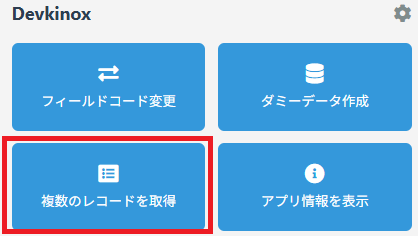
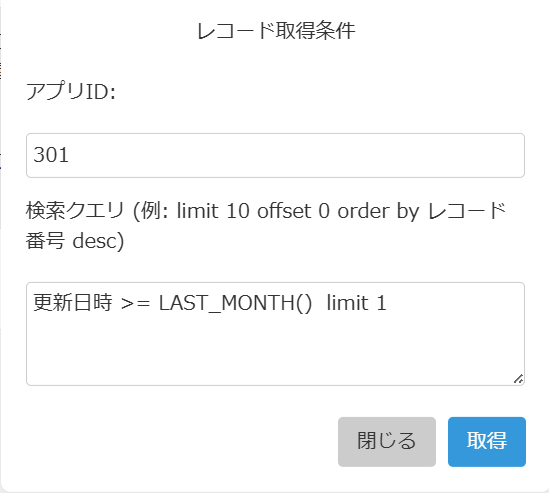
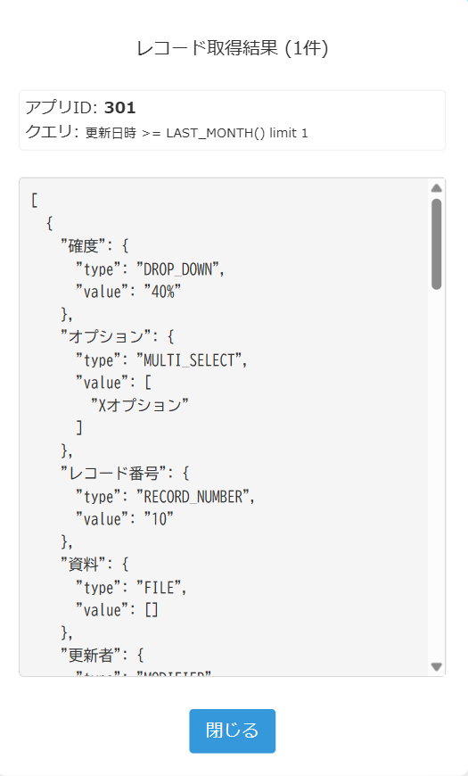

# 複数のレコードを取得

レコードのデータを取得して json 形式で確認できます。

## 使い方

1.  アプリの`一覧画面`、`詳細画面`のいずれかを開いた状態で`複数のレコードを取得`を選択

    

 

2.  データの取得条件を設定してください。`検索クエリ`欄に設定したクエリの条件でデータを取得します。

> [!TIP]
> kintone Rest API の`/k/v1/records`のクエリにそのまま設定しています。

 

3. レコードの情報が json 形式で表示されます。

   

## 注意事項

> [!NOTE]
> ゲストスペースのアプリは現行バージョンでは非対応です。

<!-- > [!NOTE] -->
<!-- > [!TIP] -->
<!-- > [!IMPORTANT] -->
<!-- > [!WARNING] -->
<!-- > [!CAUTION] -->

## その他

### 作成者

- たむら
  - 𝕏: [@Tam4641](https://x.com/Tam4641)
