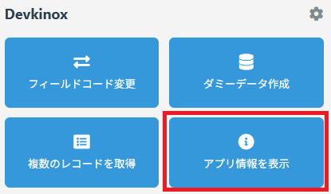
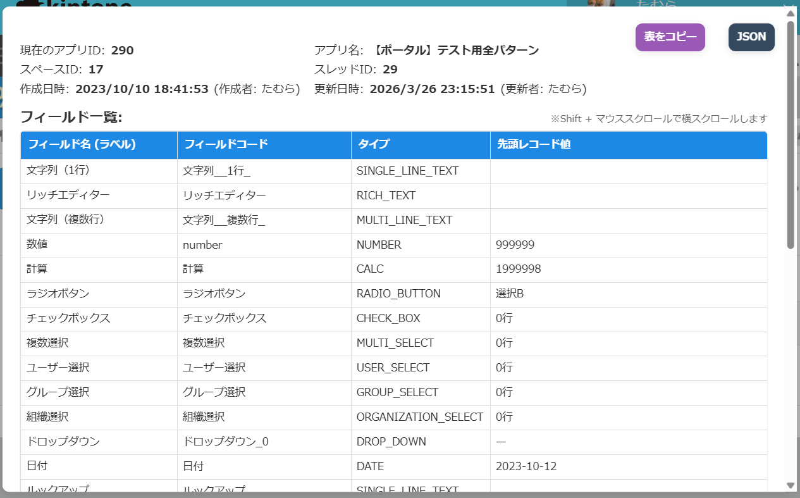

# アプリ情報を表示

現在表示しているアプリのフィールド情報などが確認できます。

## 使い方

1.  アプリの`一覧画面`、`詳細画面`、`編集画面`のいずれかを開いた状態で`アプリ情報を表示`を選択

    

 

2.  アプリの情報が表示されます。 
右上のボタンからtsv形式でのコピーと、 
json形式でのデータ表示が可能です(/v1/app.jsonの実行結果です)

## 注意事項

> [!NOTE]
> ゲストスペースのアプリは現行バージョンでは非対応です。

<!-- > [!NOTE] -->
<!-- > [!TIP] -->
<!-- > [!IMPORTANT] -->
<!-- > [!WARNING] -->
<!-- > [!CAUTION] -->

## 使用した kintone API
- [1件のアプリの情報を取得する](https://cybozu.dev/ja/kintone/docs/rest-api/apps/get-app/)
- [フィールドを取得する](https://cybozu.dev/ja/kintone/docs/rest-api/apps/form/get-form-fields/)
- [フォームのレイアウトを取得する](https://cybozu.dev/ja/kintone/docs/rest-api/apps/form/get-form-layout/)
- [複数のレコードを取得する](https://cybozu.dev/ja/kintone/docs/rest-api/records/get-records/)
- [アプリのIDを取得する](https://cybozu.dev/ja/kintone/docs/js-api/app/get-app-id/)
- [kintone REST APIリクエストを送信する](https://cybozu.dev/ja/kintone/docs/js-api/api/kintone-rest-api-request/)
- [APIのURLを取得する](https://cybozu.dev/ja/kintone/docs/js-api/api/get-url/)

## その他

### 作成者

- たむら
  - 𝕏: [@Tam4641](https://x.com/Tam4641)
