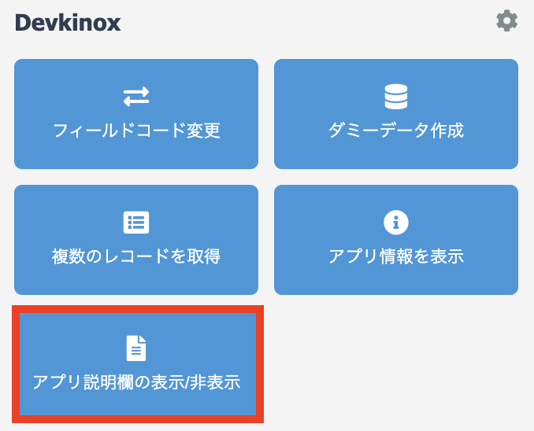
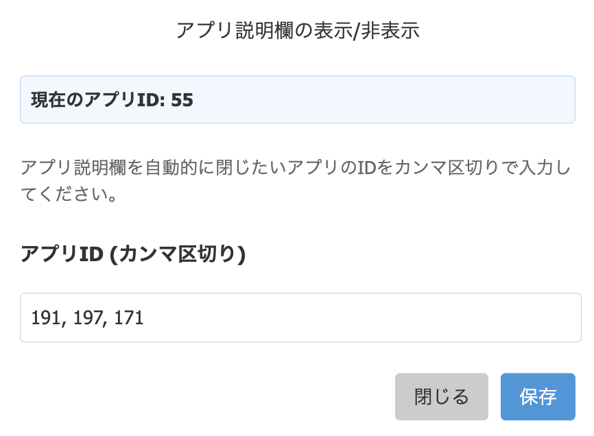

# アプリ説明欄の表示/非表示

アプリ説明欄を自動的に表示/非表示を切り替えることができます。
指定したアプリでは説明欄が自動的に閉じた状態で表示されます。

## 使い方

### 1. 設定ダイアログを開く

アプリの`一覧画面`、`詳細画面`、`編集画面`、`作成画面`のいずれかを開いた状態で`アプリ説明欄の表示/非表示`を選択します。

 

### 2. 非表示にしたいアプリIDを設定

説明欄を自動的に非表示にしたいアプリIDをカンマ区切りで入力します。
現在表示中のアプリIDも表示されるため、入力の参考にできます。

> [!TIP]
> 例: `1, 54, 67` のように複数のアプリ ID を設定できます。

 

### 3. 設定を保存

「保存」ボタンをクリックすると、設定が保存されます。
設定したアプリでは、次回表示時から説明欄が自動的に閉じた状態になります。

## 機能の詳細

### 自動適用

- 設定は localStorage に保存されます
- 設定したアプリを開くと、自動的に説明欄が閉じられます
- 一覧画面、詳細画面、編集画面、作成画面すべてで動作します

### 設定の変更

設定を変更したい場合は、再度ダイアログを開いてアプリIDを入力してください。

### 設定の解除

特定のアプリで説明欄を再び表示したい場合は、そのアプリIDを削除して保存してください。

## 注意事項

> [!NOTE]
> 設定はブラウザの localStorage に保存されるため、別のブラウザやデバイスでは設定が共有されません。

> [!WARNING]
> localStorage をクリアすると、設定が削除されます。

## その他

### 技術的な仕様

- 設定データは JSON 形式で localStorage に保存されます
- kintone の標準 API（`kintone.app.showDescription`）を使用しています
- 無効なアプリID（数値以外、0 以下）は自動的に除外されます

### 作成者

- アシノ
  - 𝕏: [@ashinohitooo](https://x.com/ashinohitooo)
